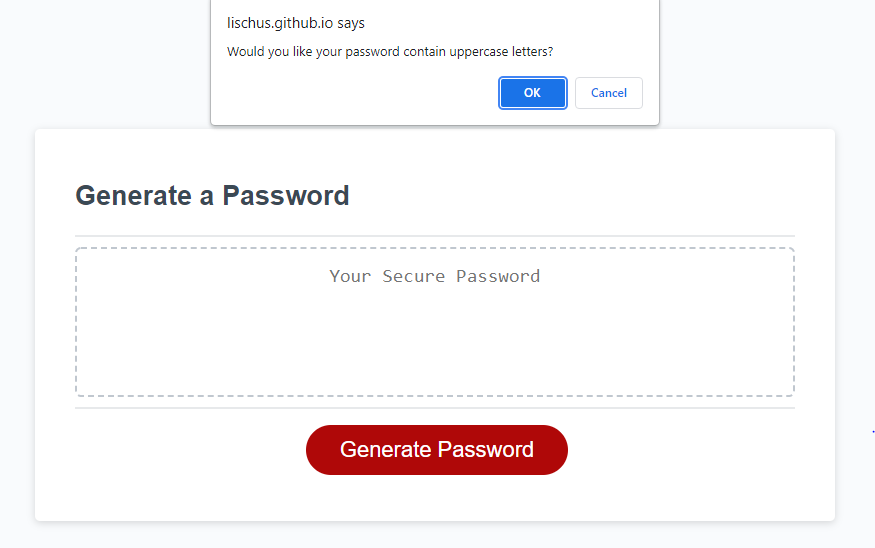
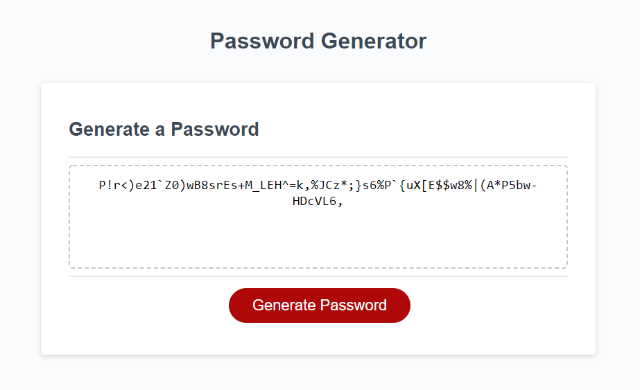

# Password Generator

## Description

The Password Generator will make you a safe and strong password given the parameters you give to it!  These parameters include the inclusion or omission of capital letters, lowercase letters, numbers and special characters.  You can also customize the length of the password given to you so that it's between 8 and 128 characters.

## Table of Contents

- [Link](#link)
- [Usage](#usage)
- [Images](#images)
- [Questions](#questions)

## Link

<a href="https://lischus.github.io/PasswordGenerator/">Deployed Application</a>

## Usage

Be sure to use this website whenever you need a new password!  With our dependence on the internet in this day and age it's very important to make sure your passwords are all strong, safe and varied!  With this website you'll never have to worry again about everything going wrong if one password happens to get leaked!

## Images

## Questions

If you have any questions please email me at martinjcorr2@gmail.com, or follow me on my Github account github.com/Lischus to learn more!
